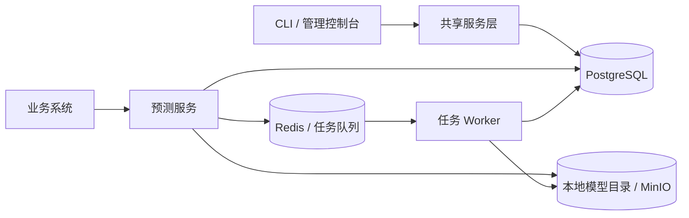

# 系统架构

Datamind 由管理入口、预测服务和任务 Worker 组成。管理入口维护模型与发布配置，预测服务处理在线请求，任务 Worker 执行批量和影子任务。各组件共享数据库与模型文件存储。

## 管理入口

CLI 和管理控制台通过共享服务层管理模型、版本、部署、路由、实验、用户和角色。服务层校验操作权限、资源状态及关联约束，将配置保存到 PostgreSQL，并记录审计信息。

启用部署会更新共享的加载期望状态。预测服务 Worker 根据该状态加载模型，各自上报运行实例。管理操作完成与节点加载完成属于不同阶段，发布时需要同时确认配置和实际运行状态。

## 预测服务

预测服务提供 HTTP 接口，负责认证、路由决策、模型加载与在线预测。一个服务可以包含多个 Worker，每个 Worker 分别持有模型和运行状态。

请求按“指定部署、运行中实验、普通路由、默认部署”的顺序选择主目标。主目标确定后，独立解析影子路由。具体优先级与分配规则见[流量分配与决策优先级](../routing/index.md)。

预测服务加载目标版本的模型文件，按任务类型返回类别、概率或评分。请求、决策和执行记录保存所用的版本及部署信息，供结果追踪和后续分析。

## 异步任务

批量和影子任务通过 Redis 消息队列交给任务 Worker 执行，任务状态、结果与错误写回数据库。

批量提交返回排队状态，调用方随后查询结果。影子任务复用主预测输入，独立执行候选版本，其结果保存在执行记录中，客户端响应仍来自主部署。

在线预测可以独立运行。使用批量或影子能力时，需启动消费对应队列的任务 Worker。进程入口与配置见[服务管理](../deployment/processes.md)。

## 数据存储

| 组件 | 保存的内容 |
| --- | --- |
| PostgreSQL | 管理资源、运行控制、实验分配、请求、决策、执行、任务状态和审计记录 |
| Redis | 批量与影子任务消息 |
| 本地目录或 MinIO | 模型文件 |

多个进程需要连接同一数据库，读取相同的模型文件，并使用兼容的模型框架。异步任务的生产者和消费者还需使用相同 Broker 与对应队列配置。拓扑、容量与备份要求见[生产部署](../deployment/production.md)。

## 实验分析

实验分析读取原始决策和主执行记录，比较分组流量、执行状态、耗时与预测分布。业务系统接收预测结果后执行自身的业务流程。指标口径与分析边界见[实验分析](../experiments/analysis.md)。
