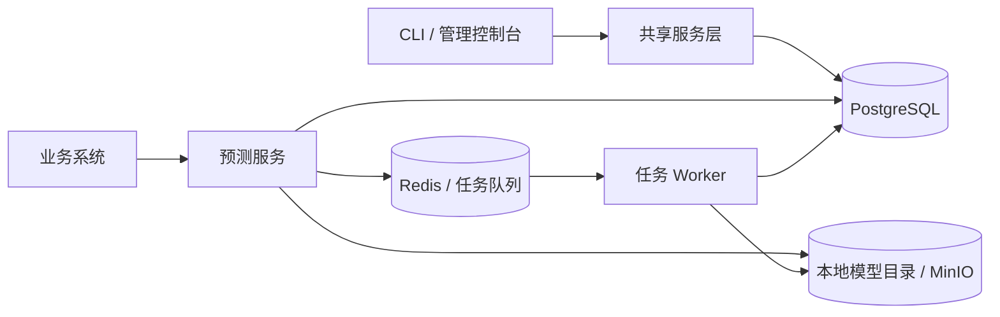
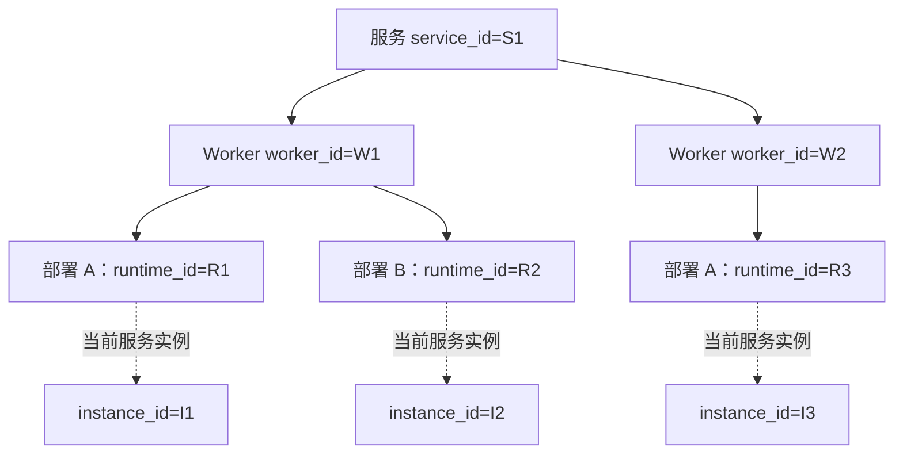

# 系统架构

Datamind 由管理入口、预测服务和任务 Worker 组成。管理入口维护模型与发布配置，预测服务处理在线请求，任务 Worker 执行批量和影子任务。各组件共享数据库与模型文件存储。

```mermaid
flowchart LR
    U[CLI / 管理控制台] --> C[共享服务层]
    C --> DB[(PostgreSQL)]
    B[业务系统] --> P[预测服务]
    P --> DB
    P --> S[(本地模型目录 / MinIO)]
    P --> Q[(Redis / 任务队列)]
    Q --> W[任务 Worker]
    W --> DB
    W --> S
```

## 管理入口

系统提供两种管理入口，共用服务层，统一校验权限、资源状态和关联约束，并保存配置及审计记录。

- **[命令行工具（CLI）](../cli/index.md)**：通过命令行执行管理操作，适合脚本调用和自动化流程。
- **[管理控制台](../guides/console.md)**：通过浏览器管理资源，查看运行状态及预测记录。

## 预测服务

- **服务职责**：提供 HTTP 接口，负责认证、路由决策、模型加载和在线预测。一个服务可包含多个 Worker，各自维护模型和运行状态。接口说明请参阅[预测 API](../reference/runtime-api.md)。
- **部署生效**：启用部署后，预测服务 Worker 根据共享的期望状态加载模型，并上报运行实例状态。发布时需同时确认部署配置和实际加载状态。具体说明请参阅[部署与运行](../deployment/index.md)。
- **请求分配**：依次按指定部署、运行中实验、普通路由和默认部署选择主目标，再独立解析影子路由。具体过程请参阅[流量分配与决策优先级](../routing/index.md)。
- **预测结果**：根据任务类型返回类别、概率或评分，并通过请求、决策和执行记录关联所用版本与部署，支持结果追踪和后续分析。响应字段请参阅[预测 API](../reference/runtime-api.md#单条预测)，任务示例请参阅[评分与分类](../guides/scoring-and-classification.md)。

### 服务、进程与运行实例标识

预测服务使用以下四种标识，分别关联服务运行、工作进程、数据库运行记录和内存中的服务实例。

| 标识 | 含义 | 生成与更新 |
| --- | --- | --- |
| `service_id` | 服务实例 ID，标识整个服务的一次运行 | 预测服务、管理控制台各自在启动时生成；同一次预测服务启动的所有 Worker 共用，重启后生成新值 |
| `worker_id` | Worker ID，标识具体工作进程 | 由主机名和进程 PID 组成；一个服务可包含多个 Worker，各自维护模型和服务缓存 |
| `runtime_id` | 运行实例 ID，标识数据库中的运行记录 | 按 `deployment_id` 和 `worker_id` 查找或创建；同一 Worker 内重新加载部署时可沿用原记录 |
| `instance_id` | 运行时服务实例 ID，标识内存中的具体服务实例 | 创建服务对象并写入缓存时生成；缓存命中时复用，服务对象重建时生成新值 |

同一部署在不同 Worker 中有各自的运行记录和服务实例。例如，一个服务启动两个 Worker，其中第一个 Worker 加载两个部署：

```mermaid
flowchart TD
    S["服务 service_id=S1"] --> W1["Worker worker_id=W1"]
    S --> W2["Worker worker_id=W2"]
    W1 --> R1["部署 A：runtime_id=R1"]
    W1 --> R2["部署 B：runtime_id=R2"]
    W2 --> R3["部署 A：runtime_id=R3"]
    R1 -. 当前服务实例 .-> I1["instance_id=I1"]
    R2 -. 当前服务实例 .-> I2["instance_id=I2"]
    R3 -. 当前服务实例 .-> I3["instance_id=I3"]
```

- **生命周期**：`runtime_id` 标识数据库运行记录，`instance_id` 标识内存中的服务实例。服务对象重建时，运行记录可以继续沿用，因此 `runtime_id` 可以不变，`instance_id` 则会生成新值。模型加载后、服务对象创建前，也可能已有运行记录，但尚无缓存服务实例。

- **缓存判断**：`identity` 保存创建服务时的 `id(runtime_model)`，用于判断关联的模型对象是否被替换。它只用于进程内的缓存判断，不作为日志或数据库运行记录的标识。

- **标识传递**：`datamind service run` 和 `datamind console run` 各自在启动时生成独立的 `service_id`，通过内部环境变量 `DATAMIND_SERVICE_ID` 传给子进程，用于日志关联。预测服务还会将其写入 Worker 就绪标记。通过 CLI 启动时无需手动配置该变量。

- **日志排查**：实例创建日志为 DEBUG 级别，包含 `instance_id`、`service_id`、`worker_id`、`deployment_id` 和 `generation`。

    排查时，先按 `service_id` 关联本次服务运行的日志，再按 `worker_id` 定位具体进程。查询数据库运行状态使用 `runtime_id`；追踪内存服务实例的创建与重建使用 `instance_id`。

## 异步任务

批量预测和影子预测通过 Redis 消息队列交给[任务 Worker](../deployment/worker.md)执行，任务状态、结果和错误写入数据库。

- **[批量预测](../guides/batch-prediction.md)**：提交后返回排队状态，调用方通过查询接口获取执行进度和预测结果。
- **[影子预测](../deployment/shadow.md)**：复用主预测输入，独立执行候选版本，结果保存在执行记录中；客户端仍接收主部署的预测结果。

仅使用在线预测时，无需启动任务 Worker。异步任务的配置与运行方式，请参阅[任务 Worker](../deployment/worker.md)。

## 数据存储

| 组件 | 存储内容 |
| --- | --- |
| PostgreSQL | 管理资源、运行控制、实验分配、请求、决策、执行、任务状态和审计记录 |
| Redis | 批量与影子任务消息 |
| 本地目录或 MinIO | 模型文件 |

- **共享要求**：各进程连接同一数据库，并能访问相同的模型文件。
- **队列配置**：异步任务的生产者与消费者使用一致的 Redis 连接和队列配置。

生产环境的部署与运维，请参阅[生产部署](../deployment/production.md)。

## 实验分析

实验分析基于决策和主执行记录，比较各分组的流量、执行状态、耗时及预测分布。指标定义与分析范围，请参阅[实验分析](../experiments/analysis.md)。
