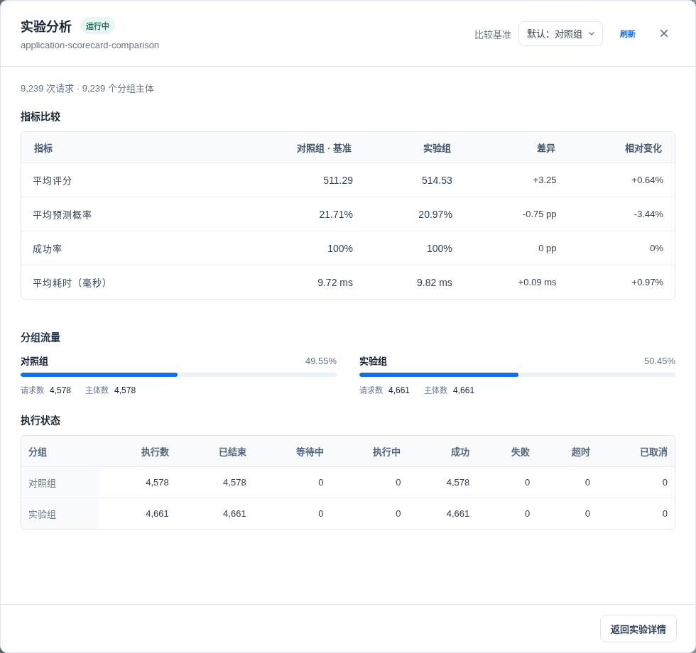

# 实验分析

实验分析使用请求决策和主执行记录，比较各分组的实际流量、运行情况与预测结果分布。产生实验请求后即可分析，无需提交额外业务数据。

## 查看分析

打开实验详情，在「实验分析」中查看请求数、主体数、成功率、平均耗时和分组摘要。详情打开时自动加载数据，点击「查看全部」进入完整分析面板。

页头提供基准选择和刷新操作，正文依次展示指标比较、分组流量和执行状态。关闭面板后返回实验详情。

- **指标比较**：各组数值、绝对差异和相对变化分别展示。默认以对照组为基准；存在多个候选分组时，每组分别展示数值及其与基准的差异。
- **分组流量**：展示实际流量比例、请求数和主体数。顶部的分组主体数为各组主体数之和，不代表跨组去重后的主体总数。
- **执行状态**：展示执行数及各状态计数，无需展开。

无有效样本的指标显示为 `—`。成功率和概率的绝对差异以 `pp`（百分点）表示，相对变化使用 `%`。悬停指标数值可查看有效样本数及最小值—最大值。



也可以使用命令行：

```bash
datamind experiment analyze <experiment_id>
datamind experiment analyze <experiment_id> --baseline-variant-id <variant_id>
```

默认使用对照组作为基准，显式基准必须属于当前实验。基准没有决策记录时仍返回各组指标，但不生成分组差异。未进入实验的请求和影子执行不计入指标。

## 指标口径

| 指标 | 含义 |
| --- | --- |
| `total_count` / `decision_count` | 请求决策记录数，重复主体的请求分别计数 |
| `subject_count` | 分组中不同主体类型与标识的组合数，缺失主体不计入 |
| `assignment_count` | 决策引用的不同实验分配 ID 数量 |
| `traffic_ratio` | 分组决策数 / 本次分析的全部实验决策数 |
| `execution_count` | 主执行记录数 |
| `completed_count` | success、failed、timeout、cancelled 状态的主执行数 |
| `success_rate` | 成功主执行数 / 已结束主执行数 |
| `average_latency_ms` | 已结束主执行中有效耗时的平均值 |
| `average_probability` / `average_score` | 成功主执行中有效概率或评分的平均值 |
| `minimum_probability` / `maximum_probability` | 成功主执行的有效预测概率范围 |
| `minimum_score` / `maximum_score` | 成功主执行的有效评分范围 |
| `decision_counts` | 决策结果的计数分布 |
| `prediction_counts` | 成功主执行中分类标签的计数分布 |

每个执行状态分别返回计数。queued、running 不进入成功率分母；尚未产生执行记录的决策仍计入流量统计。latency_count、probability_count、score_count 返回各均值的有效样本数，缺失值、布尔值与非有限值不计入。没有有效样本时，比率或均值返回 null。

流量比例描述本次已记录的实验请求，不等同于全部业务请求的曝光比例。重复请求与批量中的多条输入会分别产生决策，唯一主体数用于区分请求规模和主体规模。

## 分组比较

`comparisons` 对成功率、平均耗时、平均概率和平均评分返回分组差异。两组都有有效样本时才计算；`absolute_lift` 为分组值减去基准值，`relative_lift` 为差值除以基准值，基准为 0 时返回 null。

差值为正表示数值较高，不统一表示效果更好。例如耗时越低通常越好，预测概率和评分的含义取决于模型。预测概率不等于实际违约率，分类标签也不等于已确认的业务结果。当前分析不提供真实业务效果、置信区间、p 值或显著性结论。

## 生命周期

| 操作 | 允许状态与效果 |
| --- | --- |
| `start` | `draft` 或 `paused` → `running`；检查分组、部署、权重/映射与同环境实验冲突 |
| `pause` | `running` → `paused`；暂停实验选择，正常路由继续工作 |
| `stop` | `running` / `paused` → `stopped`；不能再次启动 |
| `complete` | `running` / `paused` → `completed`；结束实验，不自动提升候选或修改路由 |
| `archive` | `draft` / `running` / `paused` / `stopped` / `completed` → `archived`；终态 |

CLI 操作示例：

```bash
datamind experiment pause <experiment_id>
datamind experiment start <experiment_id>
datamind experiment complete <experiment_id>
datamind experiment analyze <experiment_id>
```

结束后仍可分析已有决策与执行记录。结束实验不会把实验组（`Treatment`）设为主版本。发布切换需另行管理部署（`Deployment`）和路由（`Routing`）。

## 配置修改与删除

草稿阶段设置策略、曝光比例、主体字段、时间和分组。分组的部署、权重和状态修改受实验状态约束，不应直接改数据库绕过校验。CLI 的 `experiment update` 命令在 `paused` 阶段仅允许 `description` 和 `effective_to`。`running`、`stopped`、`completed`、`archived` 不允许更新。Console/共享服务的可编辑边界以服务校验为准，暂停不恢复成草稿。

删除和恢复是独立管理动作，要求 `experiment.delete`。运行实验的删除、分组引用和恢复须遵守关联约束。先结束流量，再处理分组与部署。完整合法状态见[状态与权限](../reference/states-permissions.md)，全部参数见[实验 CLI](../cli/experiment.md)和[分组 CLI](../cli/variant.md)。
