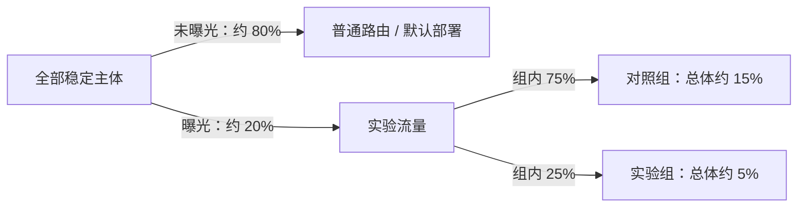

# 实验分流与固定分配

实验分流回答两个不同的问题：一个主体是否进入实验，以及进入后属于哪个实验分组。Datamind 将两步分开计算，并用 `Assignment` 持久化首次有效分配。这样，同一主体的后续预测和业务结果可以稳定归入同一组。

实验位于主路由决策的第二优先级：低于请求显式指定的 `deployment_id`，高于普通路由和默认部署。只有未进入实验的请求才继续走普通路由。完整优先级见[流量分配与决策优先级](../routing/index.md)。

## 参与实验的前置条件

一次请求进入实验判断前，需要满足：

1. 模型与环境匹配；
2. 最多存在一个状态为 `running` 的实验；
3. 当前时间满足 `effective_from <= now < effective_to`；
4. 能够解析出非空主体标识；
5. 实验配置和有效分组满足对应分配策略的约束。

若同一模型和环境存在多个运行中实验，运行时无法确定选择哪一个，会返回配置错误。Datamind 不用创建时间或名称隐式决定实验优先级。

## 主体标识如何解析

主体决定稳定分桶的粒度。运行时按以下顺序解析：

1. 预测请求显式提供的 `subject_key`；
2. 未显式提供时，读取实验配置 `bucket_key` 指向的请求载荷顶层字段；
3. 仍无法得到非空字符串或整数时，本次请求不进入实验。

显式 `subject_key` 始终优先于载荷字段。`subject_type` 只记录主体类别，不参与哈希。应使用跨请求稳定的客户号、申请号或订单号，不要使用每次调用都会变化的 `request_id`。

例如实验配置 `bucket_key=borrower_id`，请求同时传入 `subject_key=borrower-001` 和其他 `borrower_id` 时，以 `borrower-001` 分桶。`bucket_key` 只用于识别主体，不会自动修改或补充模型特征。

## 哈希策略：曝光与分组

`hash` 策略使用两个独立的 SHA-256 哈希空间，避免实验曝光比例与组内权重互相耦合。

### 第一阶段：决定是否曝光

```text
exposure = SHA-256("{experiment_id}:{subject_key}") 映射到 [0, 1)
进入实验的条件：exposure < traffic_ratio
```

`traffic_ratio` 必须位于 `(0, 1]`。例如 `traffic_ratio=0.20` 表示哈希空间前 20% 的主体进入实验；它描述长期期望比例，不保证有限样本恰好为 20%。未曝光主体不会创建 `Assignment`，而是继续普通路由。

### 第二阶段：决定实验分组

只有进入实验的主体才计算独立的组内位置：

```text
point = SHA-256("{experiment_id}:{subject_key}:variant") 映射到 [0, 1)
```

有效分组按 `variant_id`、`name` 稳定排序，再按 `weight` 划分累计区间。第一个满足 `point < cumulative_weight` 的分组获选。正权重分组的权重之和必须为 1，允许的数值误差为 `1e-8`；权重为 0 的分组不参与自动分配。

例如曝光比例为 0.20，对照组权重为 0.75，实验组权重为 0.25：



分组区间按 `variant_id`、`name` 的排序依次划分，对照组不一定位于第一个区间。

总体期望占比可写为：

```text
P(某 Variant) = traffic_ratio × Variant.weight
```

这不是普通路由比例的叠加公式。实验先于普通路由：实验命中后立即选定主部署；只有约 80% 的未曝光主体才进入普通路由层。

## Assignment 的粘滞语义

首次命中实验分组后，运行时以实验、主体和分组信息创建 `Assignment`。后续请求先查已有记录，不重新执行曝光和分组哈希。并发请求同时尝试创建时，以数据库中最终存在的记录为准，避免同一主体获得两个分组。

已有记录只有在其 Variant 仍存在且状态为 `active` 时才会复用。若对应分组不存在或已停用，本次实验分流返回未命中，不会把主体随机迁移到另一个组。路由器随后还会校验 Variant 绑定部署是否仍满足：

- 属于当前模型与环境；
- 状态为 `active` 且处于部署生效窗口；
- 不是影子部署。

部署校验失败时不会执行该实验目标，而是继续普通路由。为了保护实验一致性，不应在实验运行期间停用分组、替换部署、修改曝光比例或权重；需要改变分流方案时应创建新实验。

## 手动策略

`manual` 策略不计算曝光比例，也不按权重自动选组。它按照主体到 Variant 的显式映射选择目标：

```json
{
  "strategy": "manual",
  "manual_assignments": {
    "borrower-001": "<control_variant_id>",
    "borrower-002": "<treatment_variant_id>"
  }
}
```

未映射主体不进入实验，继续普通路由。映射目标必须属于当前实验、状态为 `active` 且权重大于 0。手动实验仍需一个有效对照组和至少一个实验组，但分组权重不表达自动流量比例。

当前 CLI 可以创建手动实验和添加分组，但没有设置手工映射的参数。可在 Console 的实验创建或草稿编辑表单中选择 `manual` 并维护主体映射。服务扩展也可向 `ExperimentService` 传递 `manual_assignments`；不能把该对象作为未声明的 Runtime 预测字段提交。

## 与路由和影子流量的关系

| 场景 | 主部署如何确定 | 后续行为 |
| --- | --- | --- |
| 请求指定 `deployment_id` | 使用并严格校验指定部署 | 跳过实验和普通路由 |
| 实验主体已有有效 Assignment | 使用 Assignment 对应 Variant 的部署 | 跳过普通路由 |
| 哈希主体未曝光 | 实验不产生结果 | 继续普通路由，再视情况回退默认部署 |
| 手工主体未映射 | 实验不产生结果 | 继续普通路由，再视情况回退默认部署 |
| 实验配置非法 | 无法完成主路由决策 | 返回路由错误，不静默回退 |
| 主部署已确定 | 不再改变主目标 | 独立解析零个或多个影子路由 |

实验暂停、停止或完成后不参与新请求的实验选择。恢复到 `running` 后会重新满足实验候选条件，并优先复用仍有效的 Assignment。完整创建流程见 [A/B 测试](index.md)，生命周期约束见[实验分析](analysis.md)。
