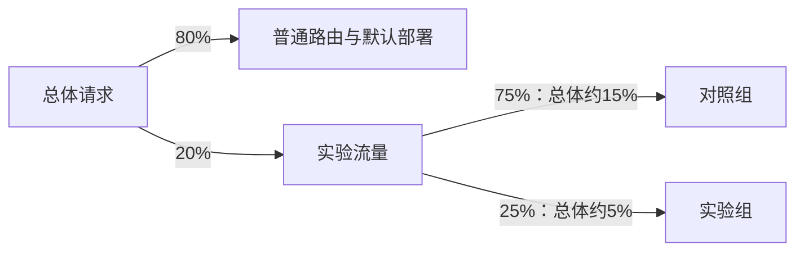

# 实验分流

实验分配（`Assignment`）记录一个主体在实验中的分组。后续预测复用这条分配，业务结果也据此归入对应组，便于稳定比较不同版本。

## 哈希分配的两个阶段

1. 根据实验与主体计算稳定曝光值，判断是否进入实验。
2. 使用独立哈希空间计算实验内部位置，再按分组权重（`weight`）选组。

实验曝光比例（`traffic_ratio`）决定多少请求进入实验；分组权重决定进入实验后分到哪一组。例如 `traffic_ratio=0.2`，对照组权重为 0.75、实验组权重为 0.25：



这些比例描述稳定哈希的分配区间，有限样本不会精确达到该比例。未曝光请求继续走普通路由与默认部署。

权重之和必须为 1，且启动时恰好一个有效对照组、至少一个实验组。运行中的同模型、同环境实验最多一个。比例与权重只能在允许的生命周期阶段配置，不能通过暂停实验随意重新分组。

## 主体解析与已有记录

显式 `subject_key` 优先。未提供时从载荷按 `bucket_key` 解析。缺少可用主体时不进入实验，继续普通路由。建议使用稳定的申请号或客户标识，`subject_type` 用于说明主体类型，避免把每次请求随机生成的 `request_id` 当作客户分桶键。

例如 `bucket_key=borrower_id`，同时提供 `subject_key=borrower-001`，会按显式主体分桶，无需把 `borrower_id` 加入模型特征。

已有实验分配优先复用，仍需对应分组有效以及绑定部署可路由。失效记录不会自动随机重分配到其他组。实验暂停、停止、完成后不再参与正常实验选择。恢复运行（`running`）会再次检查资源并复用有效分配。请求明确指定 `deployment_id` 时走定向部署，不进行实验选择。

## 手动分配

手动策略（`manual`）使用主体到分组 ID 的映射，不执行哈希曝光判断，也不按权重自动选组。当前 CLI 可以创建手动实验和添加分组，但没有设置手工映射的参数。在 Console 的实验创建或草稿编辑表单选择 `manual`，添加组并为主体指定目标组。

持久化配置形式为：

```json
{
  "strategy": "manual",
  "manual_assignments": {
    "borrower-001": "<control_variant_id>",
    "borrower-002": "<treatment_variant_id>"
  }
}
```

目标必须属于该实验的有效分组，客户标识不能为空。启动前必须配置非空映射、一个对照组和至少一个实验组，并确保部署可用。未映射主体不进入该实验。服务扩展可调用 `ExperimentService` 的 `manual_assignments` 参数，不能把此对象作为未声明的预测服务（`Runtime`）请求字段提交。

完整创建流程见[实验指南](index.md)，配置修改限制见[生命周期](analysis.md)，结果归属见[业务结果（`Outcome`）](outcomes.md)。
