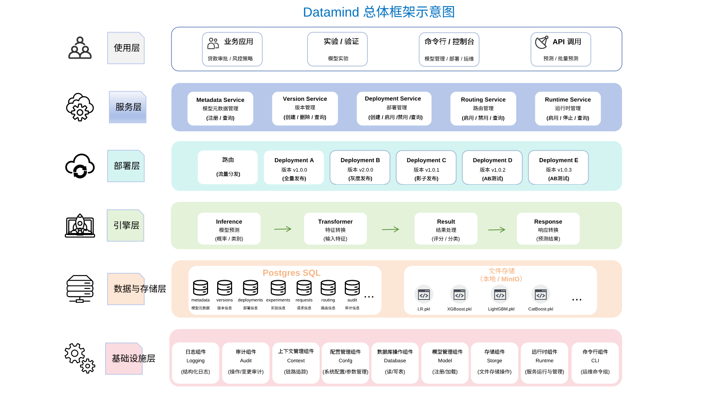

# Datamind 文档

## 快速入门

首次使用 Datamind，请先完成[安装](getting-started/installation.md)和[配置与初始化](getting-started/configuration.md)，再跟随[快速上手](getting-started/quickstart.md)，以评分卡模型为例完成注册、部署和首次预测。

准备模型文件时，可参考[模型训练示例](examples/index.md)中的分类模型与评分卡训练方法。支持的框架、模型类型与文件格式见[模型兼容性](models/compatibility.md)。

## 总体框架

Datamind 采用分层架构，将模型管理、部署发布与预测执行分开组织。**使用层**通过 CLI、管理控制台和预测 API 提供操作入口；**服务层**管理模型、版本及发布配置；**部署层**通过路由和实验配置分配预测流量；**引擎层**负责模型预测、特征转换与结果处理。**数据与存储层**保存模型文件、管理配置和运行记录，**基础设施层**提供日志、审计、配置与运行管理等公共能力。更多架构细节见[系统架构](concepts/architecture.md)。

## 核心概念

模型、版本和部署是管理模型服务的基本资源。了解模型、版本与文件修订之间的关系，请参阅[模型与版本](concepts/resources.md)；了解发布配置与实际加载状态的区别，请参阅[部署与运行](deployment/index.md)。

预测请求的目标部署由路由规则或实验配置决定。了解流量分配的决策顺序，请参阅[流量分配与决策优先级](routing/index.md)；了解实验曝光与分组机制，请参阅[实验分流](experiments/assignment.md)。服务组成与运行依赖，请参阅[系统架构](concepts/architecture.md)。

## 模型管理与发布

注册模型、更新版本、激活与停用等操作见[模型管理](models/index.md)。两类任务的输入与输出见[评分与分类](guides/scoring-and-classification.md)。

模型版本通过部署提供服务。根据发布阶段，可以选择全量发布、金丝雀发布或影子发布：

- [全量发布](deployment/full.md)：将模型版本接入正常预测流量。
- [金丝雀发布](deployment/canary.md)：逐步提高候选版本的流量比例。
- [影子发布](deployment/shadow.md)：在保留主预测结果的同时执行候选版本，用于比较结果。

## 预测与实验

Datamind 通过 HTTP 接口提供在线预测和批量预测。在线预测在请求完成后返回结果，批量预测以异步任务处理多条输入，提交后可查询任务状态并获取结果。调用方式请参阅[在线预测](guides/online-prediction.md)和[批量预测](guides/batch-prediction.md)。

通过[路由规则](routing/rules.md)指定预测请求的目标部署，通过 [A/B 测试](experiments/index.md)将流量分配到不同模型版本进行比较。实验运行后，可通过[实验分析](experiments/analysis.md)查看各分组的实际流量、执行情况与预测结果分布。

[管理控制台](guides/console.md)提供模型、部署、路由与实验的管理入口，并支持查询预测记录和任务状态。

## 部署与运维

根据部署环境和维护任务，选择相应指南：

- [本地部署](deployment/local-demo.md)：在本地运行完整演示环境。
- [Docker 部署](deployment/docker.md)：使用容器启动服务。
- [生产部署](deployment/production.md)：配置生产环境的服务与存储。
- [服务管理](deployment/processes.md)：启动、停止服务及检查运行状态。
- [访问控制](guides/access-control.md)：管理用户、角色与权限。

## 参考手册

具体命令、接口协议与配置项可直接查阅：

- [命令索引](cli/index.md)：CLI 命令、参数与用法。
- [预测 API](reference/runtime-api.md)：HTTP 接口、请求与响应。
- [请求字段](reference/runtime-schemas.md)：请求模型的字段定义与约束。
- [环境变量](reference/environment-variables.md)：完整环境变量列表与默认值。
- [状态与权限](reference/states-permissions.md)：资源状态、操作约束与权限要求。

## 开发指南

参与项目开发，请先准备[开发环境](development/index.md)，再根据工作内容查阅[扩展开发](development/extensions.md)或[前端开发](development/frontend.md)。提交变更前，请遵循[测试](development/testing.md)与[文档维护](development/documentation.md)的要求；发布流程见[构建与发布](development/release.md)。
