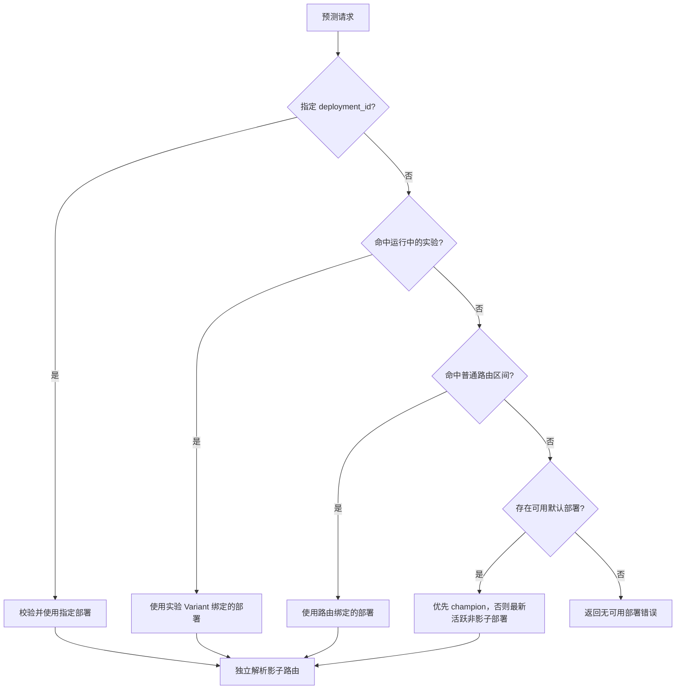

# 流量分配与决策优先级

Datamind 的运行时路由不是简单的随机负载均衡，而是一个可复现的决策过程：先确定唯一的主预测部署，再独立判断是否复制请求到零个或多个影子部署。部署负责描述“哪个版本可以运行”，路由和实验负责描述“什么请求应当使用哪个部署”。

一次路由决策的输入包括模型、环境、主体标识、请求载荷、可选的指定部署以及当前时间；输出包含主部署、决策来源、分桶信息和影子部署列表。预测执行记录会保存这些上下文，便于解释请求为何进入某个版本。

## 主部署决策顺序

主部署采用短路求值。高优先级阶段一旦返回有效目标，后续阶段不再参与本次主路由：



| 优先级 | 决策来源 | 命中条件 | 未命中或不可参与时 |
| ---: | --- | --- | --- |
| 1 | 指定部署 | 请求提供 `deployment_id`，且部署属于当前模型和环境、状态为 `active`、处于生效窗口、不是影子部署 | 指定部署非法时直接报错，不降级到实验或普通路由 |
| 2 | 实验 | 同模型、同环境存在一个处于生效窗口的 `running` 实验，主体能够解析，并命中已有分配、哈希曝光或手工映射；分组部署仍可路由 | 未曝光、无手工映射、缺少主体或分组部署不可用时继续普通路由 |
| 3 | 普通路由 | 路由已启用，路由和部署都处于生效窗口，部署可路由，规则匹配，并且稳定分桶点落入该路由区间 | 继续默认部署 |
| 4 | 默认部署 | 存在同模型、同环境、状态为 `active`、处于生效窗口的非影子部署 | 无候选时返回路由错误 |

这意味着：

- 指定部署是强制定向，不受实验和普通路由影响。
- 实验优先于普通路由。进入实验的请求不会再按金丝雀路由二次分配。
- 未进入实验的请求才进入普通路由；未命中普通路由的剩余流量才回退默认部署。
- 影子路由不争夺主流量，在主部署确定之后单独计算。

!!! warning "配置错误与正常未命中不同"
    同一模型和环境出现多个运行中实验、实验比例非法或分组权重非法，属于不可判定的配置错误，请求会返回路由错误，而不是静默绕过实验。正常的“未曝光”“主体未映射”才会继续下一级。

## 普通路由如何分配流量

普通路由先构造本次请求的候选集合。只有同时满足以下条件的路由才参与分桶：

1. 路由已启用且当前时间位于路由生效窗口；
2. 绑定部署属于请求模型和环境，状态为 `active`，且位于部署生效窗口；
3. 绑定部署不是影子部署；
4. 路由规则与请求载荷匹配。

候选路由按 `routing_id` 字符串升序排列。运行时从以下优先顺序选取稳定路由键：

1. 显式 `subject_key`；
2. 请求载荷顶层的 `subject_key`、`customer_id`、`order_id` 或 `application_id`；
3. 都不存在时使用 `model_id`。

随后计算：

```text
u = SHA-256("routing:{model_id}:{environment}:{routing_key}") 映射到 [0, 1]
```

按排序后的路由依次累加 `traffic_ratio`，第一个满足 `u < cumulative_ratio` 的路由获选。例如三条候选路由的比例依次为 `0.10`、`0.20`、`0.30`，对应区间是 `[0, 0.10)`、`[0.10, 0.30)`、`[0.30, 0.60)`；`[0.60, 1]` 不会重新归一化，而是进入默认部署回退。

因此，普通路由的 `traffic_ratio` 是总体请求空间中的绝对占比，不是候选路由之间的相对权重。候选比例总和不得超过 1；比例为 0 的路由不会获得主流量。

!!! note "规则会改变本次请求的候选集合"
    比例区间只由本次请求规则匹配成功的候选路由组成。若某条路由因规则不匹配被移除，后续候选的累计区间会前移。设计条件路由时，应把规则和比例作为一个整体验证，而不是把比例理解为跨所有请求的独立全局配额。

## 为什么分配是稳定的

相同的模型、环境和路由键会得到相同的哈希点，因此在路由配置不变时，同一主体会稳定命中同一流量区间。这种确定性有利于版本对比和问题复现，但它不是永久粘滞记录：普通路由不会为主体持久化分配。

下列变化可能让主体切换部署：

- 启用、禁用、删除或新增候选路由；
- 修改路由比例、规则或生效窗口；
- 改变 `routing_id` 的集合或排序；
- 请求使用了不同的主体键，或从有主体键退化为 `model_id`。

实验分配不同：实验首次命中后会写入 `Assignment`，后续请求优先复用有效记录。详细算法见[实验分流](../experiments/assignment.md)。

## 默认部署回退

默认回退只考虑可路由的非影子部署：模型和环境一致、状态为 `active`，并位于部署生效窗口。

- 如果存在 `champion`，选择活跃部署查询结果中的第一个 `champion`；
- 否则选择第一个活跃非影子部署；
- 活跃部署按创建时间倒序查询，因此“第一个”通常是最新创建的候选。

生产环境建议保持唯一、明确的活跃 `champion`，不要把查询顺序当成业务优先级配置。普通路由比例总和小于 1 时，剩余流量会进入此回退路径。

## 影子路由的独立语义

主部署选定后，运行时遍历满足规则和生效条件的影子路由。每条影子路由使用独立哈希空间：

```text
v = SHA-256("shadow:{model_id}:{environment}:{routing_id}:{routing_key}") 映射到 [0, 1]
命中条件：v < traffic_ratio
```

每条影子路由独立判断，所以一次请求可以命中多个影子部署。影子比例不占用普通路由的比例预算，也不会改变主预测响应；任务由影子队列异步执行。与主部署相同的目标会被排除，同一影子部署在一次请求中只执行一次。

## 配置字段

| 字段 | 作用 | 运行时语义 |
| --- | --- | --- |
| `deployment_id` | 绑定部署 | 每个未删除部署最多关联一条路由 |
| `traffic_ratio` | 流量比例 | 普通路由表示绝对主流量区间；影子路由表示该影子任务的独立采样概率 |
| `enabled` | 是否启用 | CLI 创建路由时默认关闭，启用后才参与决策 |
| `rules` | 请求条件 | 空规则匹配所有请求；非空规则必须通过其组合逻辑 |
| `effective_from` | 开始时间 | UTC 比较，边界包含，即 `effective_from <= now` |
| `effective_to` | 结束时间 | UTC 比较，边界不包含，即 `now < effective_to` |
| `rollout_type` / `rollout_group` | 创建时复制的发布元数据 | 实际是否为影子目标以当前部署的 `rollout_type` 或 `role` 为准 |

规则语法和错误处理见[路由规则](rules.md)，实验的两阶段哈希和固定分配见[实验分流](../experiments/assignment.md)，渐进发布操作见[金丝雀发布](../deployment/canary.md)和[影子发布](../deployment/shadow.md)。
